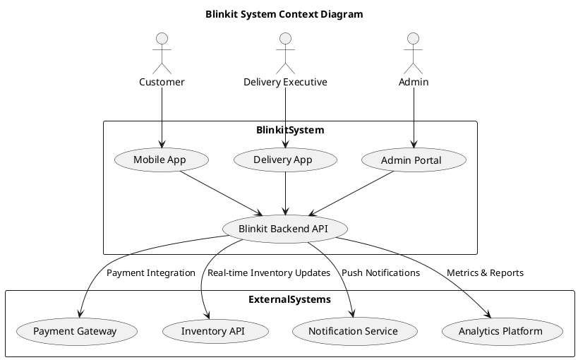
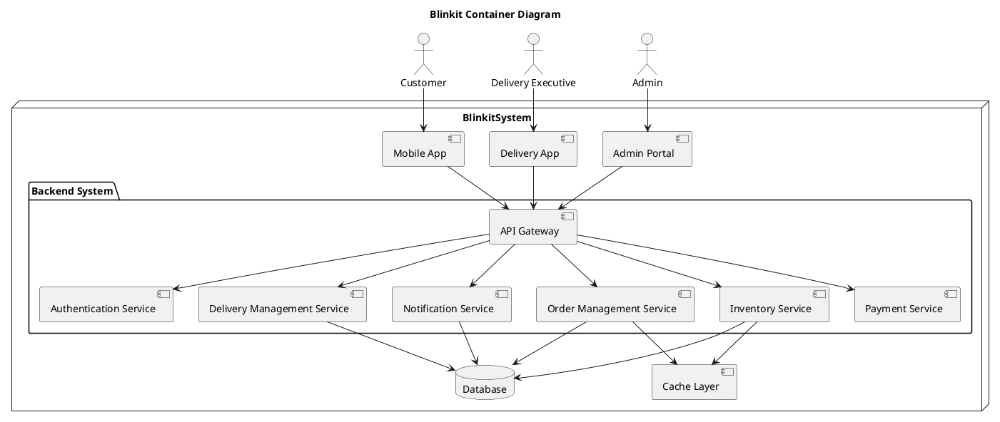
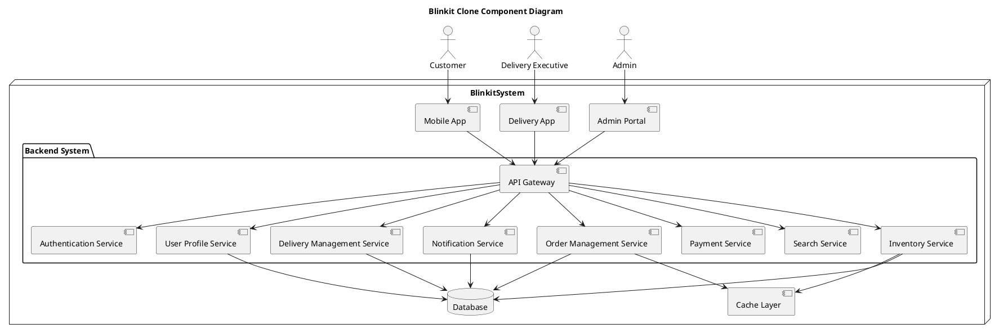
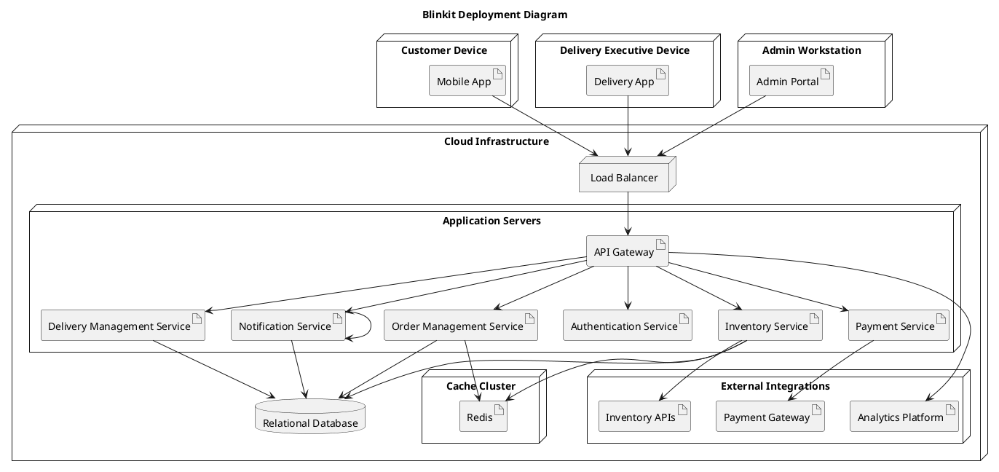

# Blinkit System Architecture

## System Context Diagram

```plantuml
@startuml
title Blinkit System Context Diagram

actor "Customer" as customer
actor "Delivery Executive" as delivery
actor "Admin" as admin

rectangle BlinkitSystem {
    customer --> (Mobile App)
    (Mobile App) --> (Blinkit Backend API)
    delivery --> (Delivery App)
    (Delivery App) --> (Blinkit Backend API)
    admin --> (Admin Portal)
    (Admin Portal) --> (Blinkit Backend API)
}

rectangle ExternalSystems {
    (Payment Gateway)
    (Inventory API)
    (Notification Service)
    (Analytics Platform)
}

(Blinkit Backend API) --> (Payment Gateway) : Payment Integration
(Blinkit Backend API) --> (Inventory API) : Real-time Inventory Updates
(Blinkit Backend API) --> (Notification Service) : Push Notifications
(Blinkit Backend API) --> (Analytics Platform) : Metrics & Reports

@enduml


```

CONTAINER

```plantuml
@startuml
title Blinkit Container Diagram

actor "Customer" as customer
actor "Delivery Executive" as delivery
actor "Admin" as admin

node BlinkitSystem {
    component "Mobile App" as mobileApp
    component "Delivery App" as deliveryApp
    component "Admin Portal" as adminPortal

    package "Backend System" {
        component "API Gateway" as apiGateway
        component "Authentication Service" as authService
        component "Order Management Service" as orderService
        component "Inventory Service" as inventoryService
        component "Delivery Management Service" as deliveryService
        component "Notification Service" as notificationService
        component "Payment Service" as paymentService
    }

    database "Database" as db
    component "Cache Layer" as cache
}

customer --> mobileApp
delivery --> deliveryApp
admin --> adminPortal

mobileApp --> apiGateway
deliveryApp --> apiGateway
adminPortal --> apiGateway

apiGateway --> authService
apiGateway --> orderService
apiGateway --> inventoryService
apiGateway --> deliveryService
apiGateway --> notificationService
apiGateway --> paymentService

orderService --> db
inventoryService --> db
deliveryService --> db

orderService --> cache
inventoryService --> cache
notificationService --> db

@enduml
```

Component 

```plantuml
@startuml
title Blinkit Clone Component Diagram

actor "Customer" as customer
actor "Delivery Executive" as delivery
actor "Admin" as admin

node BlinkitSystem {
    component "Mobile App" as mobileApp
    component "Delivery App" as deliveryApp
    component "Admin Portal" as adminPortal

    package "Backend System" {
        component "API Gateway" as apiGateway
        component "Authentication Service" as authService
        component "Order Management Service" as orderService
        component "Inventory Service" as inventoryService
        component "Delivery Management Service" as deliveryService
        component "Notification Service" as notificationService
        component "Payment Service" as paymentService
        component "Search Service" as searchService
        component "User Profile Service" as userProfileService
    }

    database "Database" as db
    component "Cache Layer" as cache
}

customer --> mobileApp
delivery --> deliveryApp
admin --> adminPortal

mobileApp --> apiGateway
deliveryApp --> apiGateway
adminPortal --> apiGateway

apiGateway --> authService
apiGateway --> orderService
apiGateway --> inventoryService
apiGateway --> deliveryService
apiGateway --> notificationService
apiGateway --> paymentService
apiGateway --> searchService
apiGateway --> userProfileService

orderService --> db
inventoryService --> db
deliveryService --> db
userProfileService --> db

orderService --> cache
inventoryService --> cache
notificationService --> db

@enduml
```

DEPLOYMENT

```plantuml
@startuml
title Blinkit Deployment Diagram

node "Customer Device" {
    artifact "Mobile App"
}

node "Delivery Executive Device" {
    artifact "Delivery App"
}

node "Admin Workstation" {
    artifact "Admin Portal"
}

node "Cloud Infrastructure" {
    node "Load Balancer" as lb
    node "Application Servers" {
        artifact "API Gateway"
        artifact "Order Management Service"
        artifact "Inventory Service"
        artifact "Delivery Management Service"
        artifact "Authentication Service"
        artifact "Notification Service"
        artifact "Payment Service"
    }
    database "Relational Database"
    node "Cache Cluster" {
        artifact "Redis"
    }
    node "External Integrations" {
        artifact "Payment Gateway"
        artifact "Inventory APIs"
        artifact "Notification Service"
        artifact "Analytics Platform"
    }
}

"Mobile App" --> lb
"Delivery App" --> lb
"Admin Portal" --> lb

lb --> "API Gateway"
"API Gateway" --> "Order Management Service"
"API Gateway" --> "Inventory Service"
"API Gateway" --> "Delivery Management Service"
"API Gateway" --> "Authentication Service"
"API Gateway" --> "Notification Service"
"API Gateway" --> "Payment Service"

"Order Management Service" --> "Relational Database"
"Inventory Service" --> "Relational Database"
"Delivery Management Service" --> "Relational Database"
"Notification Service" --> "Relational Database"

"Order Management Service" --> "Redis"
"Inventory Service" --> "Redis"

"Payment Service" --> "Payment Gateway"
"Inventory Service" --> "Inventory APIs"
"Notification Service" --> "Notification Service"
"API Gateway" --> "Analytics Platform"

@enduml
```

